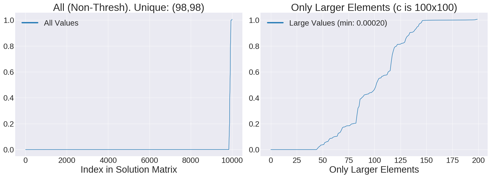
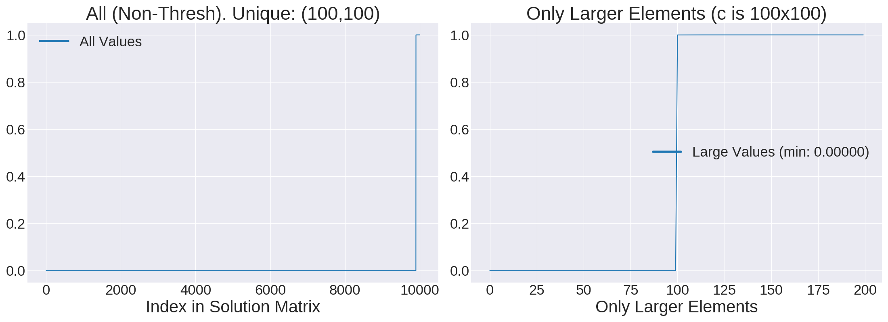

# Testing EMD Accuracy and Scalability

The `emd.py` here is inspired from the one at the top-level directory, except I am moving all
subsequent tests over here. I have figures here, which plot the *elements* in the solution matrix
`x`, which ideally is all 0s except for 1s which indicate edges. Of course, due to numerical
imprecision and various approximations, solutions will not be exact. I plot the elements in the left
sub-plot, and I "zoom-in" to the larger ones to the right, to better see where any inaccuracies
occur.

For default OSQP solver settings, [see this page][1].


## 10 x 10 Cost Matrix

Running `python emd.py` with default settings, five times, results in:
 
- Status: solved/optimal, all the time.
- Number of iterations: 100, 100, 125, 100, 100
- Sum of thresholded elements: 10.079, 9.906, 10.104, 10.008, 9.94
- Len unique: 10/10, all the time.

So, things are reasonably good, and sometimes we need 100, 125, or 150 iterations (I get 150
sometimes). Looks good, and the sum of thresholded elements is indeed around 10.

## 100 x 100 Cost Matrix

This is what we typically get for 100x100 cost matrices, we get most values 0, a few close to 1, but
oddly, we get some values roughly in between, closer to the 100-element mark in the bottom right.
This kind of makes sense. That region only has the 200 largest elements in the entire solution
matrix. (Thresholding values below 0.01 is not going to make a noticeable difference in these
plots.)



The 100x100 cost matrix case usually resolves within under 1000 iterations, so there's no point in
increasing the `max_iter` solver parameter.

*HOWEVER* .... if you run:

```
python emd.py --nrows 100 --max_iter 100000 --eps_abs 1e-5 --eps_rel 1e-5
```

I can get essentially perfect results with just about an extra second of computation. For example
this is now a typical outcome:



This looks great! This is basically what I wanted to see, as there are essentially no values between
0 and 1. The above often finishes within 2000-8000 iterations, which is easily covered with the 100K
max iterations.

## 1000 x 1000 Cost Matrix


[1]:https://osqp.org/docs/interfaces/solver_settings.html
