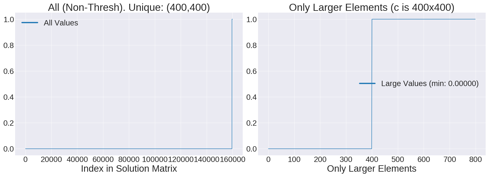
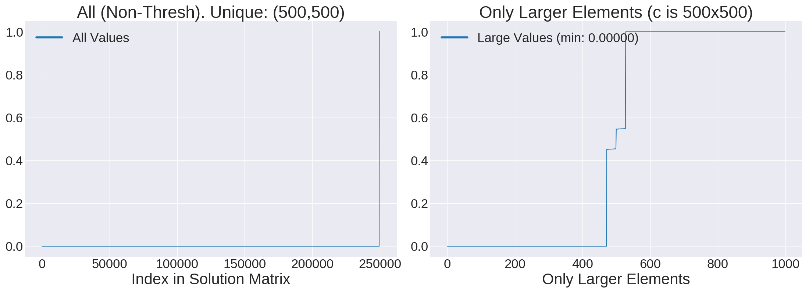
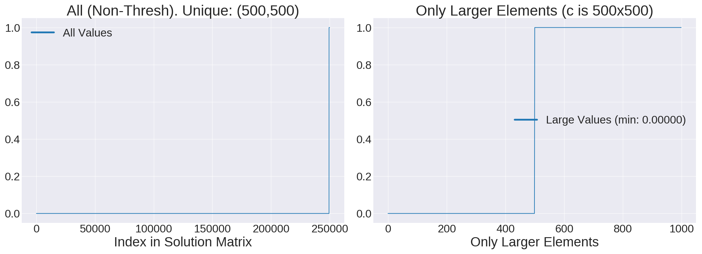

# Testing EMD Accuracy and Scalability

The `emd.py` here is inspired from the one at the top-level directory, except I am moving all
subsequent tests over here.

I plot the *elements* in the solution matrix `x`, which ideally is all 0s except for 1s which
indicate edges. Of course, due to numerical imprecision and various approximations, solutions will
not be exact. I plot the elements in the left sub-plot, and I "zoom-in" to the larger ones to the
right, to better see where any inaccuracies occur.

For default OSQP solver settings, [see this page][1].


## 10 x 10 Cost Matrix

Running `python emd.py` with default settings, five times, results in:
 
- Status: solved/optimal, all the time.
- Number of iterations: 100, 100, 125, 100, 100
- Sum of thresholded elements: 10.079, 9.906, 10.104, 10.008, 9.94
- Len unique: 10/10, all the time.

So, things are reasonably good, and sometimes we need 100, 125, or 150 iterations (I get 150
sometimes). Looks good, and the sum of thresholded elements is indeed around 10.

## 100 x 100 Cost Matrix

This is what we typically get for 100x100 cost matrices, we get most values 0, a few close to 1, but
oddly, we get some values roughly in between, closer to the 100-element mark in the bottom right.
This kind of makes sense. That region only has the 200 largest elements in the entire solution
matrix. (Thresholding values below 0.01 is not going to make a noticeable difference in these
plots.) The "unique" values are 98 and 99 in the lower left, whereas we want those to be 100 and
100.


The 100x100 cost matrix case usually resolves within under 1000 iterations, so there's no point in
increasing the `max_iter` solver parameter. That is, assuming all other parameters are set at their
default values, in particular `eps_abs` and `eps_rel`.

*HOWEVER* .... if you run:

```
python emd.py --nrows 100 --max_iter 100000 --eps_abs 1e-5 --eps_rel 1e-5
```

I can get essentially perfect results with just about an extra second of computation. For example
this is now a typical outcome:


This looks great! This is basically what I wanted to see, as there are essentially no values between
0 and 1. The above often finishes within 2000-8000 iterations, which is easily covered with the 100K
max iterations.

## 400 x 400 Cost Matrix

### Epsilon 1e-6

The 400x400 case looks good! (Note: I benchmarked the 400x400 cases after doing initial 500x500
benchmarking, since I wanted to see the runtime differences). ~16K iters, ~95 seconds. That's more
than acceptable.



I ran a few more times. In all the iters/runtimes were, including above:

- 16K iters, 95 seconds
- 35K iters, 187 seconds
- 13K iters, 71 seconds
- 16K iters, 87 seconds
- 50K iters, 277 seconds (max time, but seems like it got a good solution)

and all got what I can tell are great solutions that look like the plot above.

### Epsilon 5e-6

Here, I increase the epsilon to relax the precision requirements. I ran 10 trials with the same 50K
max iters, and got these:

- 11K iters,  61 seconds, but 399/399 unique
- 19K iters, 101 seconds
- 20K iters, 108 seconds
-  9K iters,  48 seconds
-  7K iters,  36 seconds
- 24K iters, 125 seconds
- 12K iters,  61 seconds
- 15K iters,  78 seconds
- 19K iters,  98 seconds
- 19K iters,  97 seconds

Huh, so all but *one* (the first one I ran) got 400 unique values for the maximums across the
rows/columns. Interesting. Maybe I can go with 5e-6 as the threshold, just for exploratory purposes?

## 500 x 500 Cost Matrix

I increased the precision requirements:

```
python emd.py --nrows=500 --max_iter=100000 --eps_abs=1e-6 --eps_rel=1e-6
```

and get this:



So, the 'unique' elements are correct, for all 500. There are a handful of cases where the largest
elements are not 1 but around 0.55-ish, but those are still the 'maximum' or the 'right' candidates,
it appears. The above took ~33K iterations and lasted ~300 seconds, which is still very reasonable.
I think this is probably what I can use.

Running the above a second time went a bit longer, ~54K iterations and ~450 seconds, but the
solution looks even better:



[1]:https://osqp.org/docs/interfaces/solver_settings.html
